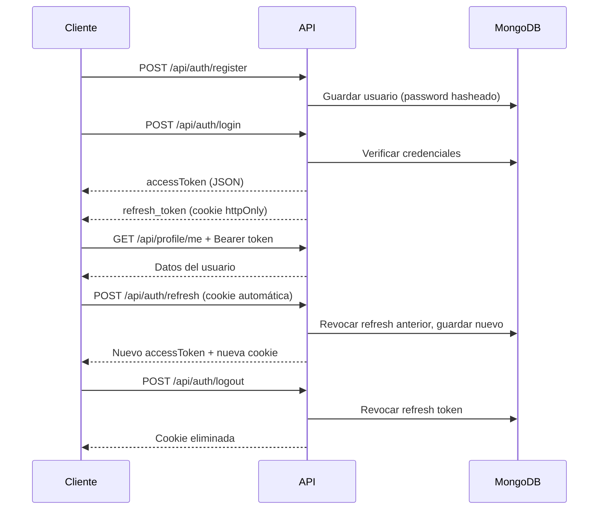

# Auth-Taller: JWT y Refresh Tokens

Implementación del taller de autenticación con **JSON Web Tokens (JWT)** y **refresh tokens**, desarrollado con Node.js, Express y MongoDB Atlas.

Referencia: [How to Build a Secure Authentication System with JWT and Refresh Tokens](https://www.freecodecamp.org/news/how-to-build-a-secure-authentication-system-with-jwt-and-refresh-tokens/) — Joan Ayebola, FreeCodeCamp.

---

## Descripción

Este proyecto es una API REST que implementa un flujo de autenticación completo:

- Registro e inicio de sesión con contraseñas hasheadas (bcrypt)
- Emisión de **access tokens** JWT de corta duración (15 min)
- Emisión de **refresh tokens** de larga duración (7 días) en cookie httpOnly
- Rotación de refresh tokens en cada renovación
- Protección de rutas mediante middleware
- Revocación de sesión en logout

---

## Requisitos

- [Node.js](https://nodejs.org/) v18+
- npm
- Cuenta en [MongoDB Atlas](https://www.mongodb.com/atlas)
- [Postman](https://www.postman.com/) o Insomnia

---

## Instalación

```bash
git clone https://github.com/Timmy0825XD/Auth-Taller.git
cd Auth-Taller
npm install
```

Copiar el archivo de entorno y completar las variables:

```bash
cp .env.example .env
```

### Variables de entorno

| Variable | Descripción |
|----------|-------------|
| `PORT` | Puerto del servidor (default: `5000`) |
| `MONGO_URI` | URI de conexión a MongoDB Atlas |
| `JWT_SECRET` | Secreto para firmar access tokens |
| `REFRESH_TOKEN_SECRET` | Secreto distinto para refresh tokens |
| `NODE_ENV` | `development` o `production` |

Generar secretos:

```bash
node -e "console.log(require('crypto').randomBytes(32).toString('hex'))"
```

En MongoDB Atlas, habilitar **Network Access** con la IP del equipo (o `0.0.0.0/0` solo para desarrollo).

> El archivo `.env` no se sube al repositorio. Usar secretos **distintos** para `JWT_SECRET` y `REFRESH_TOKEN_SECRET`.

---

## Ejecución

```bash
# Desarrollo (recarga automática)
npm run dev

# Producción
npm start
```

Verificar en `http://localhost:5000` — respuesta esperada: `JWT Auth API running`

Consola esperada:

```
Server running on port 5000
MongoDB connected
```

---

## Cómo funciona

### Flujo general



### Access token vs refresh token

| | Access token | Refresh token |
|---|-------------|---------------|
| Duración | 15 minutos | 7 días |
| Uso | Cada petición protegida | Solo para renovar el access token |
| Transporte | Header `Authorization: Bearer ...` | Cookie httpOnly (`path: /api/auth/refresh`) |
| Secreto | `JWT_SECRET` | `REFRESH_TOKEN_SECRET` |
| Almacenamiento en BD | No (stateless) | Sí, como hash SHA-256 |

### Componentes principales

| Archivo | Responsabilidad |
|---------|-----------------|
| `routes/auth.js` | Register, login, refresh y logout |
| `routes/profile.js` | Ruta protegida de ejemplo (`GET /me`) |
| `middleware/auth.js` | Verifica el access token en cada petición protegida |
| `utils/tokens.js` | Creación, persistencia y rotación de tokens |
| `models/user.js` | Esquema de usuario |
| `models/refreshToken.js` | Registro de refresh tokens con estado de revocación |
| `config/db.js` | Conexión a MongoDB Atlas |

### Rotación de refresh tokens

Al llamar a `/api/auth/refresh`:

1. Se valida la cookie y el registro en base de datos
2. Se marca el token anterior como revocado (`revokedAt`)
3. Se genera un nuevo par access + refresh con un `jti` distinto
4. Se guarda el hash del nuevo refresh token

Si alguien intenta reutilizar un refresh token ya rotado, la API responde con `401`.

### Seguridad aplicada

- Contraseñas hasheadas con bcrypt (cost factor 10)
- Secretos separados para access y refresh tokens
- Refresh tokens hasheados antes de guardarse en MongoDB
- Cookie httpOnly con `sameSite: 'strict'` y `secure` en producción
- Access tokens de corta duración para limitar el riesgo si se filtran

---

## Estructura del proyecto

```
Auth-Taller/
├── server.js
├── config/db.js
├── models/
│   ├── user.js
│   └── refreshToken.js
├── middleware/auth.js
├── routes/
│   ├── auth.js
│   └── profile.js
└── utils/tokens.js
```

---

## Endpoints

Base URL: `http://localhost:5000`

### POST `/api/auth/register`

```json
{
  "username": "demoUser",
  "email": "demo@email.com",
  "password": "mypassword"
}
```

| Status | Respuesta |
|--------|-----------|
| `201` | `{ "message": "User created successfully" }` |
| `400` | `{ "message": "User already exists" }` |

### POST `/api/auth/login`

```json
{
  "email": "demo@email.com",
  "password": "mypassword"
}
```

| Status | Respuesta |
|--------|-----------|
| `200` | `{ "accessToken": "..." }` + cookie `refresh_token` |

### POST `/api/auth/refresh`

Sin headers. Postman envía la cookie automáticamente.

| Status | Respuesta |
|--------|-----------|
| `200` | `{ "accessToken": "..." }` + nueva cookie |
| `401` | Token ausente, inválido, expirado o revocado |

### POST `/api/auth/logout`

| Status | Respuesta |
|--------|-----------|
| `200` | `{ "message": "Logged out" }` |

### GET `/api/profile/me`

Header requerido: `Authorization: Bearer <accessToken>`

| Status | Respuesta |
|--------|-----------|
| `200` | `{ "user": { "_id", "username", "email" } }` |
| `401` | Token ausente, inválido o expirado |
| `404` | `{ "message": "User not found" }` |

---

## Demostración con Postman

1. **Register** — `POST /api/auth/register` con username, email y password → `201`
2. **Login** — `POST /api/auth/login` → copiar `accessToken`; Postman guarda la cookie
3. **Perfil** — `GET /api/profile/me` con header `Authorization: Bearer <token>` → datos del usuario
4. **Token inválido** — repetir sin header o con token inventado → `401`
5. **Refresh** — `POST /api/auth/refresh` → nuevo `accessToken`
6. **Logout** — `POST /api/auth/logout` → intentar refresh de nuevo → `401`

---

## Referencia

- Artículo base: [How to Build a Secure Authentication System with JWT and Refresh Tokens](https://www.freecodecamp.org/news/how-to-build-a-secure-authentication-system-with-jwt-and-refresh-tokens/)
